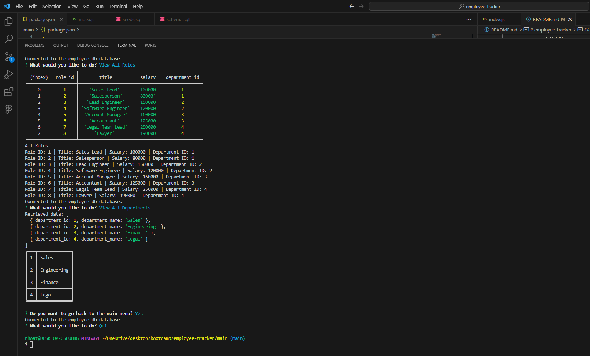

# employee-tracker
  by Barkley Rhoat
   
  ## Table of Contents
  * [Description](#description)
  * [Requirements](#requirements)
  * [Usage](#usage)
  * [Contact-Me](#contact-me)
  * [Contributors](#contributors)
  * [Testing](#testing)
  * [License](#license)
  ## Description
    Employee-tracker is a command-line base application the is going to help manage a company's employee database that uses Node.js, inquirer and MySQL. 
  ## Requirments
  Inquirer 8.2.4, nodemon, MySQL
  ## Usage
  Node, MySQL
  ## Contact-Me
  * Name - Barkley Rhoat
  * Email - BarkleyRhoat@gmail.com
  * Github - [BarkleyRhoat](https://github.com/BarkleyRhoat/)
  ## Contributors
  n/a
  ## Testing

  Link for video walkthrough: https://drive.google.com/file/d/16HPfSo7rbIj00tVRtnTWQA8sYiCrQpFk/view

## credits

W3 Schools
Chat GTP
 
  
  ## License

      Licensed under the MIT license.